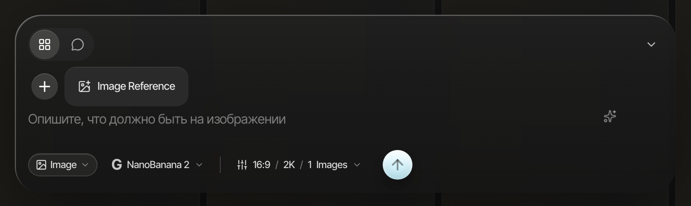
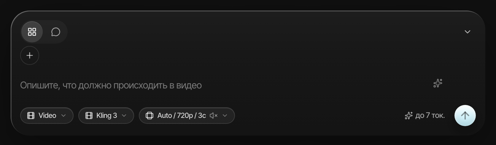
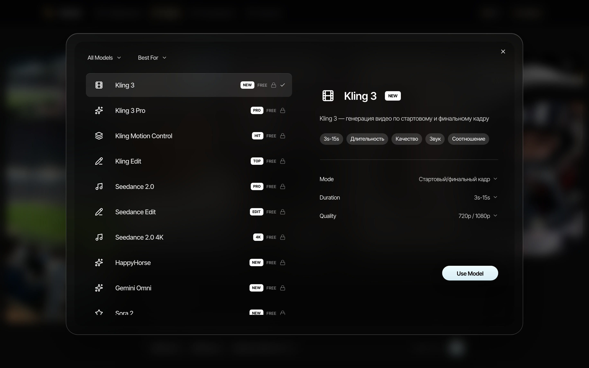
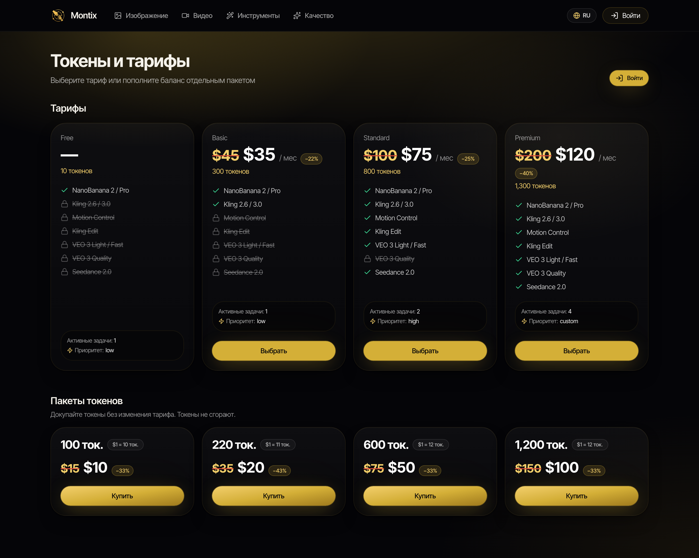
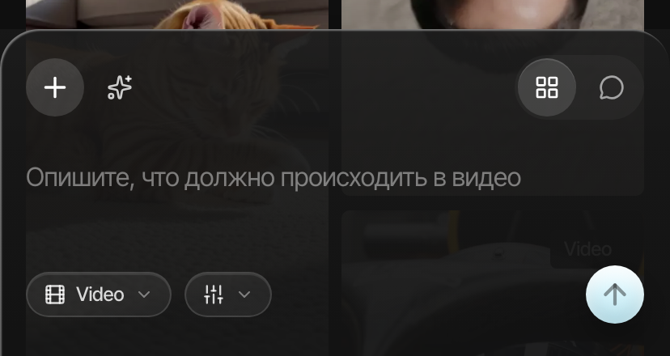
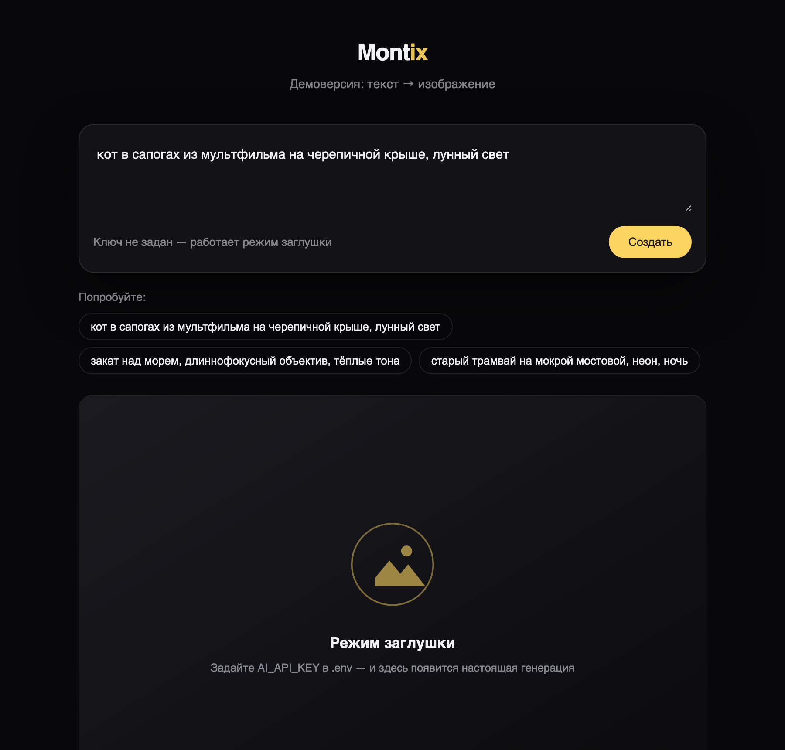

<div align="center">

# Montix

**Генерация изображений и видео нейросетями — в одном окне, на русском, узбекском и английском**

[](https://montix.ai)
[](https://nextjs.org)
[](https://fastapi.tiangolo.com)
[](https://postgresql.org)


</div>

---

## 📌 Что это

Montix — работающий сервис, а не прототип. Пользователь пишет текстом, что хочет
увидеть, выбирает модель и получает картинку или ролик. Всё, что обычно
разбросано по десятку разных сайтов с отдельными подписками, собрано в один
композер: и генерация с нуля, и оживление фотографии, и редактирование готового
видео, и апскейл.

Задача, которую решали: между «хочу такой кадр» и «вот кадр» не должно быть
изучения интерфейса. Поэтому композер один на все модели, а различия между ними
интерфейс подставляет сам — какие файлы модель принимает, сколько их, какие
доступны длительности и разрешения.

| | |
|---|---|
| 🎬 **Видео** | 13 моделей: Kling, Seedance, Veo, Sora, Gemini Omni и другие |
| 🖼 **Изображения** | генерация, редактирование по референсам, повышение качества |
| 🌍 **Языки** | русский, узбекский, английский — включая тексты ошибок |
| 💳 **Оплата** | Payme, Click, Uzum — тарифы и разовые пакеты токенов |
| 🤖 **Телеграм** | бот с теми же генерациями и распознаванием голосовых |
| 📱 **Устройства** | один интерфейс для телефона и компьютера |

---

## 🖼 Интерфейс

<table>
<tr>
<td width="50%"><br><sub><b>Композер изображений.</b> Модель, соотношение сторон, разрешение и количество кадров — в одной строке под полем промпта.</sub></td>
<td width="50%"><br><sub><b>Композер видео.</b> Тот же композер, другие параметры: длительность, звук, качество.</sub></td>
</tr>
</table>



<sub><b>Каталог моделей.</b> У каждой модели свои режимы и ограничения — они приходят с сервера и правятся из админки без пересборки фронтенда.</sub>

<table>
<tr>
<td width="62%"><br><sub><b>Тарифы.</b> Цена генерации считается до нажатия кнопки, а списывается по факту.</sub></td>
<td width="38%"><br><sub><b>Телефон.</b> Композер закреплён снизу и не перекрывает результат.</sub></td>
</tr>
</table>

---

## 🧩 Как устроено

Схема и пояснения — в [docs/architecture.md](docs/architecture.md).

Коротко: браузер и телеграм-бот ходят в одно HTTP-API. Задача на генерацию не
выполняется в запросе — она попадает в очередь в базе, её забирает воркер, идёт
к провайдеру моделей, складывает результат в хранилище и возвращает ссылку.
Такое разделение нужно потому, что видео делается минутами, а HTTP-запрос
столько жить не должен.

Ключи провайдеров живут только на сервере. Браузер их не видит никогда.

---

## 🔐 Примеры кода

В [examples/](examples/) — самостоятельные фрагменты, показывающие подход. Это
не выгрузка платформы, а отдельно написанные примеры, которые можно прочитать и
запустить по отдельности.

| Файл | О чём |
|---|---|
| [`signed_media.py`](examples/signed_media.py) | Подписанные ссылки на файлы: результат виден владельцу и провайдеру, но не тому, кто просто подобрал адрес |
| [`content_guard.py`](examples/content_guard.py) | Отказ по запрещённому содержанию **до** списания денег, с разделением «запрещено» и «просто на грани» |
| [`credits.py`](examples/credits.py) | Резерв и списание кредитов: почему деньги не списываются в момент запуска |
| [`ai_call.py`](examples/ai_call.py) | Вызов ИИ-модели: таймауты, повторы, идемпотентность |

---

## ▶️ Демоверсия

Маленькое запускаемое приложение: страница, поле ввода, кнопка — и настоящий
вызов модели генерации изображений. Ключ подставляете свой.

```bash
git clone https://github.com/shceo/montix_f.git
cd montix_f/demo
python -m venv .venv && source .venv/bin/activate
pip install -r requirements.txt
cp .env.example .env      # впишите свой ключ провайдера
python app.py             # http://127.0.0.1:8000
```



<sub>Без ключа демо работает в режиме заглушки: интерфейс, фильтр содержания и ограничение частоты живые, вместо картинки — placeholder.</sub>

Подробнее: [DEMO.md](DEMO.md).

---

## 🛠 Стек

**Фронтенд** — Next.js 16 (App Router, React Server Components), TypeScript,
Tailwind CSS, Radix UI. Три локали, серверный рендеринг публичных страниц.

**Бэкенд** — Python, FastAPI, SQLAlchemy (async), Alembic, PostgreSQL.
Очередь задач — в самой базе, через `SELECT … FOR UPDATE SKIP LOCKED`: отдельный
брокер для такой нагрузки был бы лишней движущейся частью.

**Инфраструктура** — nginx, systemd, выкладка неизменяемыми релизами с
переключением симлинка (откат = переключить обратно).

---

## 📄 Про этот репозиторий

Витрина для конкурса. Здесь **нет** исходного кода платформы, ключей, паролей,
`.env`, адресов серверов и схемы базы. Всё, что лежит в `examples/` и `demo/`,
написано отдельно для этого репозитория и ничего из боевой системы не раскрывает.

Скриншоты сняты с публичных страниц сайта. Чужие работы пользователей на них не
попали намеренно.
