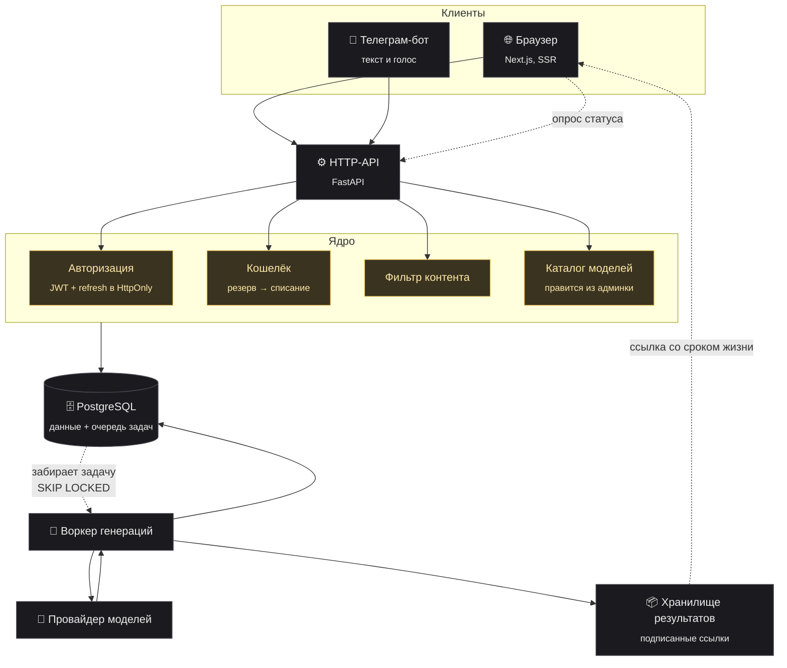
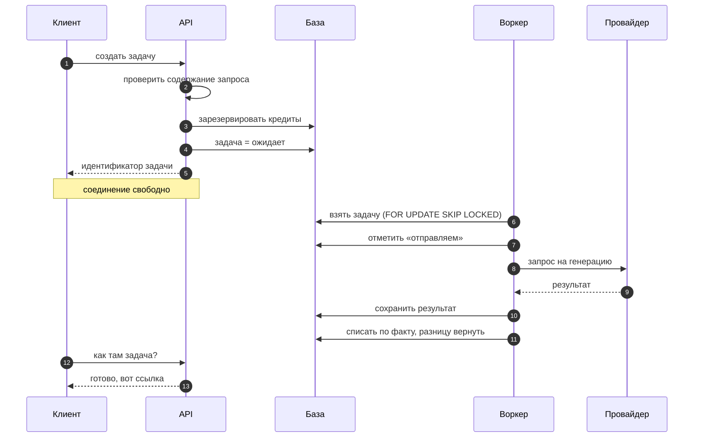

# Архитектура

Схема концептуальная: показывает, кто с кем разговаривает и почему именно так.
Конкретные адреса, порты, имена сервисов и схема базы сюда намеренно не входят.

## Общая картина



## Почему очередь, а не прямой вызов

Видео делается минутами. Держать всё это время открытым HTTP-запрос — значит
уронить генерацию при любом обрыве связи, перезапуске или таймауте прокси.

Поэтому запрос на генерацию только создаёт запись в базе и сразу отвечает
идентификатором. Дальше:



Шаг «отметить „отправляем“» записывается **до** обращения к провайдеру. Если
процесс в этот момент умрёт, по этой отметке видно: запрос мог уйти и мог быть
оплачен. Такую задачу нельзя молча перезапустить — иначе клиенту выставят счёт
дважды.

`SKIP LOCKED` позволяет запустить несколько воркеров одновременно: каждый берёт
свою задачу и никогда чужую. Отдельный брокер очередей на такой нагрузке был бы
лишней движущейся частью — база и так есть, и транзакция даёт то же самое.

## Деньги

Цена известна до нажатия кнопки, но провайдеры считают по факту: длительность,
разрешение и реальный расход у разных моделей отличаются от оценки.

```
оценка  ──▶  резерв  ──▶  генерация  ──▶  списываем min(оценка, факт)
                 │                              │
                 └── видна как «занято» ────────┴── разница возвращается
```

Пока задача идёт, деньги не списаны — они удержаны. Клиент не может потратить
их дважды, и при неудаче ничего возвращать не приходится: удержание просто
снимается. Именно поэтому в интерфейсе цена подписана как потолок, а не как
итог.

## Доступ к файлам

Результаты генерации не лежат в открытом доступе. Ссылка на файл содержит срок
жизни и подпись; сервер проверяет подпись перед отдачей. Провайдеру входные
файлы уходят по такой же ссылке — ему не нужен постоянный доступ к хранилищу,
только на время работы.

Пример реализации: [`../examples/signed_media.py`](../examples/signed_media.py).

## Каталог моделей

Список моделей, их режимы, ограничения по файлам и цены лежат в базе и правятся
из админки. Фронтенд получает контракт и строит интерфейс по нему: сколько
файлов принимает модель, каких типов, какие доступны длительности.

Это сделано после того, как стало ясно: провайдеры добавляют и меняют модели
чаще, чем разумно выкатывать релизы. Новая модель появляется на сайте без
пересборки и без деплоя.

## Разделение по слоям

| Слой | Отвечает за | Не знает про |
|---|---|---|
| Фронтенд | как показать и что спросить | ключи, цены провайдеров, устройство очереди |
| API | правила, деньги, доступ | как именно устроен конкретный провайдер |
| Воркер | довести задачу до результата | HTTP-сессии, интерфейс |
| Провайдер-адаптер | язык конкретного вендора | бизнес-правила, тарифы |

Смена провайдера модели затрагивает только адаптер.

## Что защищено

- Ключи провайдеров — только на сервере, в браузер не попадают ни при каком сценарии.
- Токен доступа живёт в памяти вкладки, обновление — через HttpOnly-cookie, недоступную скриптам.
- Загружаемые файлы проверяются по типу и размеру до записи.
- Ошибки провайдера не показываются как есть: клиент видит понятный текст, технические детали остаются в логах.
- Запрещённое содержание отсеивается до списания денег ([`../examples/content_guard.py`](../examples/content_guard.py)).
- Публичная документация API отключена в продакшене.
